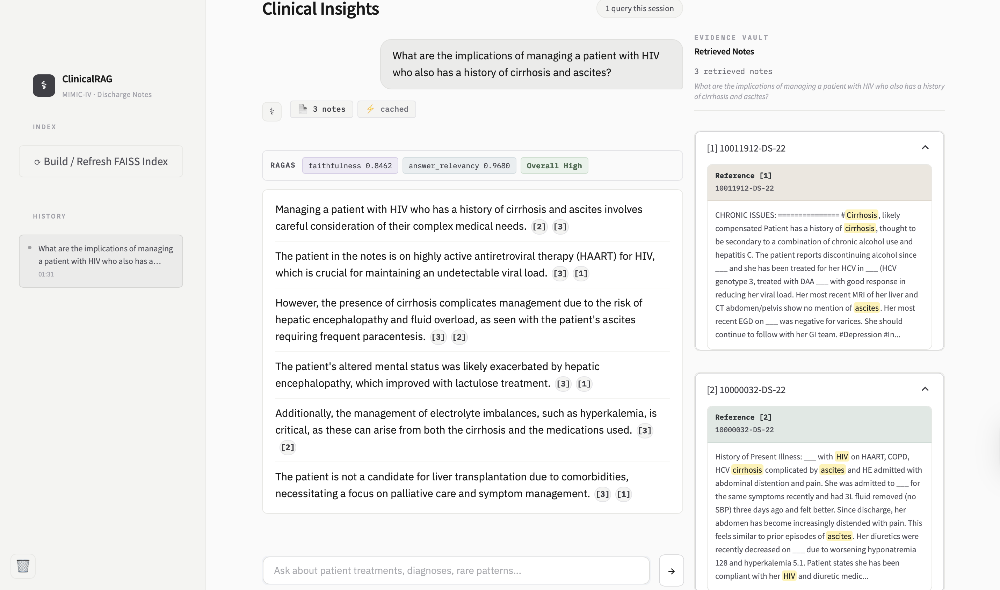
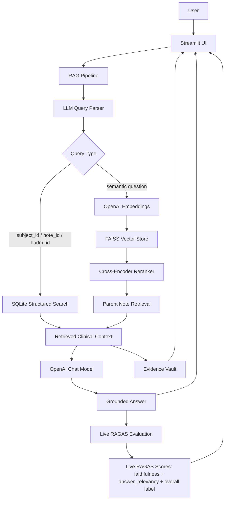

# Clinical Note Intelligence with RAG

**Helping users find grounded answers faster from unstructured clinical discharge notes**

🏆 **2nd Place — Big Data & AI Trends Market 2026**  
University of Minnesota Carlson School of Management, MSBA Program

---

## Executive Summary

Clinical notes are stored as long, fragmented, and inconsistent unstructured text, making it difficult for clinicians and analysts to search across patient histories or answer clinical questions quickly.

This project implements a Retrieval-Augmented Generation (RAG) system that combines structured search, semantic retrieval, reranking, grounded LLM generation, and response-quality evaluation. The Streamlit interface supports patient-level chart review and cross-note clinical question answering by retrieving relevant discharge notes, synthesizing answers from retrieved evidence, and displaying supporting notes through an Evidence Vault.

The system uses a FAISS vector store for semantic similarity search, SQLite for direct patient/note/admission lookup, OpenAI embedding and chat models for retrieval and generation, and RAGAS-based evaluation to assess response quality.

---

## Use Cases

- **Patient-Level Analysis (Chart Review):** Retrieve and summarize a specific patient's clinical history using `subject_id`, `note_id`, or `hadm_id`.
- **Population-Level Insights (Scalable Analysis):** Search across clinical notes to identify recurring symptoms, diagnoses, treatments, and patterns across patient groups.
- **Evidence-Backed Question Answering:** Generate concise clinical answers constrained to retrieved notes, with supporting evidence shown in the UI.
- **Response Quality Review:** Display live RAGAS `faithfulness`, `answer_relevancy`, and an `Overall` quality label derived from those two RAGAS scores to help users inspect whether the generated answer is well supported.

---

## Demo

A short demo video is available here:

https://github.com/user-attachments/assets/559e7994-86d4-4946-838c-c0c9437c2924

---

## Demo Interface



The demo interface shows:

- grounded generated answers
- retrieved supporting notes
- live RAGAS metrics: `faithfulness` and `answer_relevancy`
- a RAGAS-based `Overall` quality label derived from `faithfulness` and `answer_relevancy`
- an Evidence Vault for inspecting the retrieved context behind the response

---

## Key System Capabilities

- **Intent-Aware Routing:** Parses user queries and routes them to patient lookup, note lookup, admission lookup, or semantic retrieval.
- **Intent-Based Retrieval Routing:** Routes identifier-based queries such as `subject_id`, `note_id`, and `hadm_id` to SQLite structured search, while general clinical questions use FAISS semantic retrieval with reranking.
- **Parent Note Context:** Retrieves full parent notes from top-ranked chunks to preserve clinical context before generation.
- **Grounded Generation:** Constrains LLM answers to retrieved clinical-note context, reducing unsupported responses.
- **Reranking:** Uses a cross-encoder reranker to improve the relevance of retrieved chunks before generation.
- **Evidence Vault:** Displays retrieved supporting notes, metadata, snippets, and note IDs in the Streamlit interface.
- **Live Evaluation Display:** For successful app responses with retrieved context, the interface attempts live RAGAS scoring and displays `faithfulness`, `answer_relevancy`, and a derived `Overall` quality label based on the two scores.
- **Offline Evaluation Support:** Includes a RAGAS evaluation notebook that can auto-generate test questions from the configured corpus and run batch evaluation.
- **Synthetic Demo Dataset:** Includes a synthetic discharge-note sample so reviewers can test the pipeline without access to restricted MIMIC-IV Note data.

---

## System Architecture



---

## Repository Structure

```text
.
├── app.py                              # Streamlit web application
├── requirements.txt                    # Python dependencies
├── .env.example                        # Environment variable template; no API keys included
├── .gitignore                          # Excludes secrets, real data, cache, logs, and local outputs
├── clinicalrag_demo.png                # App demo screenshot shown in this README
├── flier.pdf                           # Project summary flier
├── slide.pdf                           # Final presentation slide deck exported as PDF
├── ragas_evaluation.ipynb              # Offline RAGAS test generation and evaluation workflow
├── evaluation_results/
│   └── README.md                       # Notes for generated local evaluation outputs
├── data/
│   └── sample/
│       ├── README.md                   # Synthetic sample data notice and usage notes
│       └── discharge_sample.csv        # Synthetic discharge-note sample for public demo testing
├── storage/
│   └── .gitkeep                        # Runtime storage placeholder; generated DB/index files are ignored
└── src/
    ├── agent.py                        # RAG workflow orchestration helpers
    ├── cache.py                        # Query response and RAGAS score cache
    ├── config.py                       # Environment and model configuration
    ├── csv_to_sqlite.py                # CSV-to-SQLite loader for structured search
    ├── data_sources/
    │   └── csv_loader.py               # CSV document loader
    ├── embeddings.py                   # OpenAI embedding model setup
    ├── evaluator.py                    # Retrieval and rerank quality checks
    ├── ingest.py                       # Data ingestion, chunking, and FAISS index build
    ├── live_ragas.py                   # Live RAGAS scoring for app responses
    ├── llm.py                          # OpenAI chat model prompts and generation calls
    ├── logger.py                       # Pipeline logging utilities
    ├── parser.py                       # LLM-based query intent parser
    ├── pipeline.py                     # End-to-end RAG pipeline entry point
    ├── reranker.py                     # Cross-encoder reranker
    ├── retriever.py                    # FAISS retrieval logic
    ├── state.py                        # Pipeline state schema
    ├── structured_search.py            # subject_id, note_id, and hadm_id search
    └── vectorstore.py                  # FAISS vector store load/save logic
```

---

## Data

This project is designed to work with discharge notes from **MIMIC-IV Note 2.2**, together with relevant metadata from **MIMIC-IV 3.1**. Chunk-level metadata includes `note_id`, `subject_id`, `hadm_id`, and source fields.

### Real Clinical Data

The real MIMIC-IV and MIMIC-IV Note datasets are not included in this repository. Reviewers who want to run the full pipeline with real clinical notes must obtain credentialed access through PhysioNet and complete the required training and Data Use Agreement requirements.

- MIMIC-IV: [https://physionet.org/content/mimiciv/3.1/](https://physionet.org/content/mimiciv/3.1/)
- MIMIC-IV Note: [https://physionet.org/content/mimic-iv-note/2.2/](https://physionet.org/content/mimic-iv-note/2.2/)

After downloading the authorized data, place the real `discharge.csv` file in a local directory outside version control, or update the `DATA_PATH` value in `.env` to point to its location. For example:

```text
DATA_PATH=/path/to/discharge.csv
```

If running the full authorized file locally from the project root, you may also use:

```text
DATA_PATH=./discharge.csv
```

The `.gitignore` is configured so local real-data files such as `discharge.csv` are not committed to GitHub.

### Synthetic Sample Data

For reviewers who do not have credentialed PhysioNet access, this repository includes a small synthetic sample file:

```text
data/sample/discharge_sample.csv
```

This file contains 1,000 fictitious discharge summary records with the same column structure as MIMIC-IV Note `discharge.csv`. It is intended only for testing CSV loading, chunking, embedding, retrieval, structured lookup, and RAG pipeline behavior. It does not contain real patient information and should not be used for clinical analysis, medical decision-making, or evaluation claims about real patient populations.

For more detail, see:

```text
data/sample/README.md
```

---

## Prerequisites

- Python 3.10+
- OpenAI API key
- Optional: authorized MIMIC-IV / MIMIC-IV Note access through PhysioNet for full-data local testing

---

## Setup & Installation

These steps run the project with the included synthetic demo dataset. No MIMIC-IV access is required for this demo setup.

```bash
# 1. Clone the repository
git clone https://github.com/kojunghsu/clinical-note-rag-intelligence.git
cd clinical-note-rag-intelligence

# 2. Create and activate a virtual environment
python3 -m venv .venv
source .venv/bin/activate

# 3. Install dependencies
python3 -m pip install --upgrade pip
python3 -m pip install -r requirements.txt

# 4. Configure environment variables
cp .env.example .env
```

Open `.env` and set your OpenAI key. For the public synthetic demo dataset, use:

```text
OPENAI_API_KEY=your_openai_api_key_here
OPENAI_CHAT_MODEL=gpt-4o-mini
OPENAI_EMBED_MODEL=text-embedding-3-small
DATA_PATH=./data/sample/discharge_sample.csv
FAISS_INDEX_DIR=./storage/faiss_index
CACHE_DB_PATH=./storage/cache.sqlite
SQLITE_DB_PATH=./storage/notes.db
```

Then build the local database and vector index:

```bash
# 5. Build the SQLite notes database for structured search
python3 -m src.csv_to_sqlite

# 6. Build the FAISS vector index
python3 -m src.ingest

# 7. Run the Streamlit UI
streamlit run app.py
```

Open the local Streamlit URL shown in the terminal, usually:

```text
http://localhost:8501
```

---

## Running Locally with a Full Authorized Discharge CSV

For local full-data testing, place your authorized `discharge.csv` file in the project root folder:

```text
clinical-note-rag-intelligence/
├── discharge.csv
├── app.py
├── .env
└── src/
```

Then update `.env`:

```text
OPENAI_API_KEY=your_openai_api_key_here
DATA_PATH=./discharge.csv
```

Rebuild the database and index:

```bash
python3 -m src.csv_to_sqlite
python3 -m src.ingest
streamlit run app.py
```

Generated local artifacts such as `storage/notes.db`, FAISS index files, cache files, logs, and full discharge data are intentionally excluded from GitHub.

---

## Usage Examples

After launching the Streamlit app, users can ask questions such as:

```text
Summarize note_id SYN-DS-000001.
```

```text
Summarize the hospitalization for hadm_id 20000000.
```

```text
What treatments were documented for acute kidney injury due to dehydration?
```

```text
What discharge follow-up plans were documented for stroke patients?
```

```text
Summarize pneumonia treatment patterns in the discharge notes.
```

The application returns:

- a grounded answer
- retrieved supporting notes in the Evidence Vault
- live RAGAS `faithfulness` and `answer_relevancy` scores when available
- a RAGAS-based `Overall` label derived from `faithfulness` and `answer_relevancy`

If the retrieved notes do not contain enough evidence, the app may return an explicit fallback instead of fabricating an answer. This behavior is expected for a grounded RAG system.

---

## Evaluation & Verification

The Streamlit app includes integrated live RAGAS evaluation for successful grounded responses with retrieved context.

The UI displays:

| Metric | Meaning |
|---|---|
| `faithfulness` | Whether the generated answer is supported by the retrieved notes |
| `answer_relevancy` | Whether the generated answer directly addresses the user question |
| `overall` | Derived quality label based on the two RAGAS scores: High if both are >= 0.75, Medium if both are >= 0.50, Low otherwise |

The `Overall` label is a simple UI summary of RAGAS score quality, not a calibrated clinical confidence score.

If RAGAS evaluation fails because of an API, package, or timeout issue,
the app still displays the answer and the Evidence Vault.
The RAGAS metric panel is not shown for that response.

The repository also includes `ragas_evaluation.ipynb` for offline experimentation, auto-generated question testing, and batch RAGAS evaluation workflows.

---

## Limitations

- The system is a course project prototype and is not intended for clinical deployment.
- Generated answers depend on the quality and coverage of retrieved notes.
- RAG reduces hallucination risk but cannot eliminate it entirely.
- The RAGAS-based `Overall` label is a simple threshold-based quality indicator, not a statistically calibrated clinical confidence score.
- MIMIC-IV data is deidentified, but access and handling must still follow PhysioNet requirements.
- The public synthetic demo dataset is intended for functionality testing only and should not be used for clinical inference or research claims.
- Local paths and large data artifacts may need to be adjusted for each user's environment.

---

## Future Enhancements

- The current demonstration uses the `discharge.csv` component of the MIMIC dataset. The data source can be adapted to other note files or datasets by updating the `DATA_PATH` variable in the `.env` configuration.
- Additional tuning of retrieval and generation hyperparameters in `config.py` may further improve performance.
- The retrieval workflow includes a rewrite step, but query rewriting is currently disabled by design: the system passes the original query forward as `rewritten_query`. In clinical-note search, aggressive rewriting may omit important clinical nuances, so future versions could revisit guarded query rewriting with stronger safeguards.
- The current cache implementation uses exact query string matching. Future versions could improve efficiency through semantic or similarity-based caching.
- Prompt engineering for both LLM layers, the query parser and clinical answer generator, can be further improved through few-shot prompting, stronger guardrails, and more structured negative prompting.

---

## Usage and License Note

This repository is shared for academic and portfolio purposes. Please contact the project team before reusing or redistributing the code.
